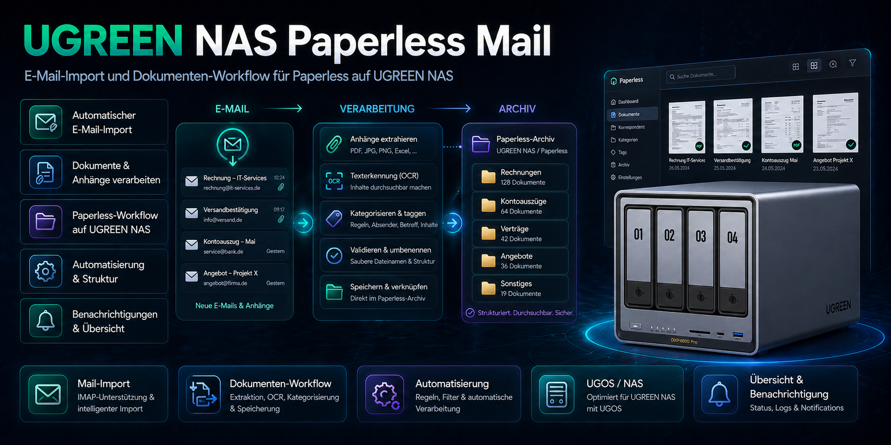

# Paperless Mail (UGREEN NAS)


Community-Paket für **UGREEN NAS (UGOS Pro)**: Docker-Setup für **paperless-ngx** (Redis + PostgreSQL) plus **Export-Skript mit optionalem E-Mail-Versand**.

- **Deutsch**: `de/`
- **English**: `en/`
- **Release-ZIPs (DE/EN)** zum Hochladen in GitHub Releases: `release-assets/` (wird nicht committet)

## Inhalt

- `docker-compose.yaml` + `paperlessngx.env` (Template)
- `scripts/paperless-export_with_mail.sh`  
  Erstellt ZIP-Exports via `document_exporter`, optionaler SMTP-Mailversand (Text + HTML) und Retention.

## Voraussetzungen

- UGREEN NAS mit **UGOS Pro** und Docker-Unterstützung
- Für Mailversand: funktionierender SMTP-Server (Zugangsdaten in `paperlessngx.env`)
- paperless-ngx wird über offizielle Container-Images betrieben (siehe Projektseite)

## Installation (Quickstart)

1) Ordner kopieren (Beispiel):
- Deutsch: `de/paperless-ngx/` nach z.B. `/volume2/docker/paperless-ngx/`

2) Konfiguration anpassen:
- Datei `paperlessngx.env` editieren (Pfade, Ports, SMTP)

3) Stack starten (Beispiel):
```bash
cd /volume2/docker/paperless-ngx
docker compose up -d
```

4) Export-Test (Beispiel):
```bash
cd /volume2/docker/paperless-ngx/scripts
bash ./paperless-export_with_mail.sh
```

## Dokumentation

- Handbuch DE (PDF): `de/UGREEN_Paperless-ngx_Anleitung_DE_v1.0.pdf`
- Handbuch EN (PDF): `en/UGREEN_Paperless-ngx_Guide_EN_v1.0.pdf`

## GitHub Release erstellen (mit den fertigen ZIPs)

Die Release-ZIPs liegen lokal in `release-assets/` (werden nicht committed):

```powershell
gh release create v1.0.0 ".\release-assets\paperless-ngx-community-Pack_Mail_de_v1.zip" ".\release-assets\paperless-ngx-community-Pack_Mail_en_v1.zip" `
  --title "Paperless Mail v1.0.0" `
  --notes "Initialer Release (DE/EN)."
```

## Struktur

```text
de/
  paperless-ngx/
  UGREEN_Paperless-ngx_Anleitung_DE_v1.0.pdf
en/
  paperless-ngx/
  UGREEN_Paperless-ngx_Guide_EN_v1.0.pdf
release-assets/
  paperless-ngx-community-Pack_Mail_de_v1.zip
  paperless-ngx-community-Pack_Mail_en_v1.zip
```
